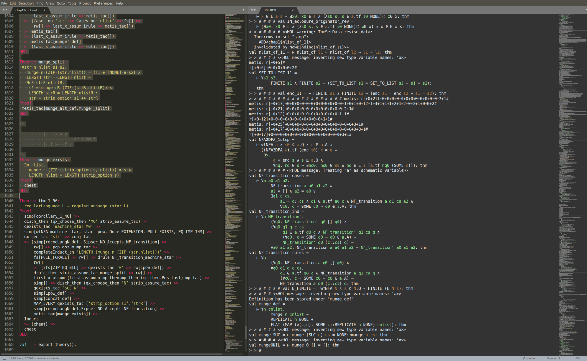

HOL for Sublime Text (2nd Edition)
=====================================

A HOL ITP (https://hol-theorem-prover.org/) development environment.
Some parts taken from SML-syntax (https://github.com/Takaia/SML-syntax).




Dependencies
------------
* HOL Theorem Prover (https://hol-theorem-prover.org/)
* Sublime Text plugin Terminus (https://github.com/randy3k/Terminus)
* An installed C Compiler

Installation
-------------
1. You must have HOL installed (https://hol-theorem-prover.org/)
2. You must have Terminus installed (https://github.com/randy3k/Terminus)
3. Clone this repository into your Packages folder and **rename it to HOL**
4. Inside the newly renamed ``HOL`` repo you cloned, build ``filter.c`` with your
favourite C compiler to an executable called ``filter`` in the same folder
5. In the Sublime Text menu select ``Preferences -> Package Settings -> HOL -> Settings-User``
6. In opened settings file enter:
    ```
    {
        "holpath":"/your/path/to/binary/here/hol"
    }
    ```

Features
--------
#### HOL Files
* HOL Syntax Highlighting
* Tab completion from `` ` `` to smart quote pair ``‘’``
    * Also from ` `` ` to ``“”``
* Unicode tab completion within HOL terms for common HOL ASCII sequences
    * Logical Symbols
        * ``!`` to ``∀``
        * ``?`` to ``∃``
        * ``~`` to ``¬``
        * ``==>`` to ``⇒``
        * ...and many more!
    * The Greek alphabet
        * ``'a`` to ``α``
        * ``'b`` to ``β``
        * ``'c`` to ``γ`` *and* ``'C`` to ``Γ``
        * ``'d`` to ``δ`` *and* ``'D`` to ``Δ``
        * ``'e`` to ``ε``
        * ``'f`` to ``'ζ``
        * ``'g`` to ``η``
        * ``'h`` to ``θ``
        * ``'i`` to ``ι``
        * ``'j`` to ``κ``
        * (No ``'k`` or ``'K`` binding)
        * ``'l`` to ``μ``
        * ``'m`` to ``ν``
        * ``'n`` to ``ξ`` *and* ``'N`` to ``Ξ``
        * (No ``'o`` or ``'O`` binding)
        * ``'p`` to ``π`` *and* ``'P`` to ``Π``
        * ``'q`` to ``ρ``
        * ``'r`` to ``ς``
        * ``'s`` to ``σ`` *and* ``'S`` to ``Σ``
        * ``'t`` to ``τ``
        * ``'u`` to ``υ``
        * ``'v`` to ``φ`` *and* ``'V`` to ``Φ``
        * ``'w`` to ``χ``
        * ``'x`` to ``ψ`` *and* ``'X`` to ``Ψ``
        * ``'y`` to ``ω`` *and* ``'Y`` to ``Ω``
        * (No ``'z`` or ``'Z`` binding)
#### HOL REPL
* Full colour REPL (Uses HOL's ``vt100_terminal`` backend)
* Send selection, lines, and entire files straight to REPL in Sublime
* Automatically format selection/lines into:
    * Goals
    * Subgoals
        * Basic subgoals
        * Sufficient Condition
    * Tactics
    * Quiet mode
* Changes Flags from menus or key bindings
    * Show Types
    * Show Assums
    * Print Goal at Top
    * Print Free Variables
* You cannot directly type in the REPL but instead work from a HOL file

Usage
-------
* ``HOL`` submenu under Tools in Sublime for all the operations and their keybindings
* Note you *must* work from a file, you cannot directly type in the REPL
* For more details and more control please see the key bindings and preference files available under the preferences menu
* To change the colour scheme of the REPL use the "Terminus Utilities: Select Theme" command in Sublime Text
* Note: The terminal is speedy enough for interactive use but large imports should be done in quiet mode as they
can take some time to colourise!

License
--------
Everything is licensed under GPLv2, please see LICENSE.txt
